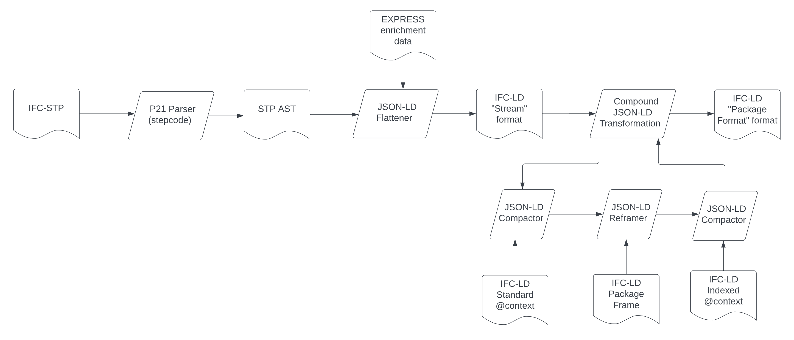

= IFC-LD
v0.2, January, 2024
:sectnums:
:figure-caption!:
:toc:
:source-highlighter: pygments
:data-uri:

== Rationale

IFC-LD is a data model and family of serializations designed to support the exchange of information about the built environment. It is interoperable with all existing versions of IFC, while embracing new directions. Practically, IFC-LD aims to "rebase" IFC on https://en.wikipedia.org/wiki/Linked_data[linked data], allowing the community to (incrementally) shed its dependency on https://www.iso.org/standard/63141.html[ISO 10303], including the P21 ("STEP") instance format and EXPRESS schema language. 

IFC-LD attempts to solve several problems with IFC-based data exchanges:

1. To avoid use of custom parsers for https://www.iso.org/standard/63141.html[ISO 10303-21] ("P21") files, IFC-LD defines a simple instance data model based on the https://en.wikipedia.org/wiki/Resource_Description_Framework[Resource Description Framework] (RDF). IFC-LD instance data may be exchanged using any https://www.w3.org/wiki/RdfSyntax[RDF-compatible serialization]. https://www.w3.org/TR/json-ld11/[JSON-LD] is taken as the normative IFC-LD serialization to simplify adoption. 

2. To avoid the need for bespoke data validation tools, IFC-LD replaces https://en.wikipedia.org/wiki/EXPRESS_(data_modeling_language)[EXPRESS] with https://www.w3.org/TR/shacl/[SHACL] as the de facto encoding of the IFC schema. Given a SHACL-encoded snapshot of the IFC schema, and an IFC-LD instance population, users can validate the instance population against the schema using any SHACL processor. Users may use SHACL to extend these rules for their own use, similar to what they do today with https://www.buildingsmart.org/what-is-information-delivery-specification-ids/[IDS].

3. To minimize the burden of integrating IFC instances with adjacent built asset information, IFC-LD supports seamless integration with adjacent data models like https://brickschema.org/[brick], https://w3c-lbd-cg.github.io/bot/[bot], and https://www.realestatecore.io/[realestatecore]. 

Rebasing IFC on a minimal but complete (lossless) set of linked data standards is what allows IFC-LD to integrate all existing IFC schemas while supporting new directions.

== Goals

=== Data Addressability
All exchanged data must be unformly addressable, because linking or referencing data requires it have a name. Given the distributed, global nature of the built environment, the most natural namespace for built assets is the web, where shared assets are addressable by URIs. 

=== Interoperability (with STEP)
The vast majority of the world's existing IFC data is encoded as ISO 10303-21 files. It is also the primary serialization existing commercial systems support. To encourage broad adoption of IFC-LD, and to ensure we can migrate existing asset data, interoperability with the Part 21 exchange format is required. Likewise, the EXPRESS encoding of the IFC schema must be replaced with one of equal of greater expressive power.

=== Data Distribution
The data describing built assets is inherently distributed, because stakeholders describe assets from different points of view at different points in time. Any forward-looking exchange strategy, including IFC-LD, must take widespread data distribution and composition as prerequisites.

=== Extensibility
The IFC-LD specification cannot anticipate every need. Instead, it must provide a small set of capabilities that could later be extended. Rather than inventing these extension capabilities from scratch, it can leverage those it builds upon (i.e., RDF, SHACL). 

== Design

=== Instances

IFC-LD maps P21 instance features directly to RDF, supporting near-lossless conversion between the two. A complete description of the mapping can be found in <<P21 to IFC-LD Instance Mappings>>. In summary:

1. Each P21 instance file is translated to an RDF named graph.
2. P21 file metadata become property-value pairs on the named graph.
3. P21 instances become RDF resources. Each instance is assigned a URI by treating its P21 instance number ("#21") as a https://www.w3.org/TR/turtle/#relative-iri[relative URI] to the base URI of the exchange file. 
4. P21 instance properties are indexed by name (e.g., `owningapplication`), taken from the IFC-LD SHACL schema during conversion. 
5. P21 instance types (e.g., `ifcapplication`) are converted to the equivalent https://www.w3.org/TR/rdf-schema/#ch_type[rdf:type] relation. 
6. P21 literal values are presented as structured values (https://www.w3.org/TR/rdf-schema/#ch_value[rdf:value]). This simplifies schema-instance alignment, provides a straightforward way to support IFC's type system, and ensures nested P21 instances (e.g., `IFCRATIOMEASURE(41.4)`) and unnested instances serialize consistently. 

By convention, all IFC-LD type and property names are encoded in lowercase. 

Example P21 instances and their IFC-LD equivalents can be found in <<IFC-LD Instance Examples>>.

=== Schemas

To fulfill its <<Goals>>, IFC-LD must adopt a schema language that is:

- at least as expressive as EXPRESS, including support for types, relations, and closed-world validation
- serialization-agnostic
- capable of supporting integration with domain-adjacent data models

https://www.w3.org/TR/shacl/#[SHACL] fulfills these requirements, providing a rich schema language backed by a W3C standard with both open and commercial tooling support.

Many EXPRESS constructs have direct equivalents in SHACL. Where there is ambiguity, IFC-LD follows these heuristics:

- *Treat all structural parts of the IFC schema as first-class*. This maximizes reuse because the same  definition (e.g., of a particular property, like `owningapplication`) can be reused across the schema without duplication. This reduces the size of the schema and cognitive load on those who need to learn it. 
- *Treat all values as structured values*. This increases the size of serialized instances, but allows schema definitions to be reused across different contexts. It also allows instance values to be treated as resources, allowing them to carry additional metadata (e.g., who asserted them, and why). 
- *Use logical operations to model entity composition and selection* (e.g., `sh:and`, `sh:xone`). Formal inheritance hierarchies are replaced by independent schema definitions joined by logical operations. 

Given an IFC-LD instance population and the SHACL encoding of the corresponding IFC schema, the population can be validated against the schema using any conforming SHACL processor. No custom tooling, intermediary data format, or centralized validation service is required. 

.EXPRESS to SHACL Schema Mapping
|===
| Express | SHACL 

|Entity| https://www.w3.org/TR/shacl/#node-shapes[sh:NodeShape]
|Entity Property| https://www.w3.org/TR/shacl/#node-shapes[sh:NodeShape] (Properties become first-class structured values)
|Abstract Entity| https://datashapes.org/dash#abstract-classes[dash:abstract] flag
|Entity Inheritance| https://www.w3.org/TR/shacl/#AndConstraintComponent[sh:AndConstraintComponents]
|Types|https://www.w3.org/TR/shacl/#node-shapes[sh:NodeShape] targeting an https://www.w3.org/TR/rdf-schema/#ch_value[rdf:value] structured value
|Enumerations|https://www.w3.org/TR/shacl/#property-shapes[sh:PropertyShapes] targeting https://www.w3.org/TR/shacl/#InConstraintComponent[sh:in]
|Selects|https://www.w3.org/TR/shacl/#node-shapes[sh:NodeShape] targeting https://www.w3.org/TR/shacl/#XoneConstraintComponent[sh:xone]
|Where Rules| https://www.w3.org/TR/shacl-af/#rules[SHACL Rules]
|Functions| https://www.w3.org/TR/shacl-af/#functions[SHACL Functions]
|===

For example mappings between IFC EXPRESS objects and their SHACL equivalents, see <<EXPRESS to SHACL Examples>>. 

For SHACL encodings of existing IFC standards, see <<IFC SHACL Schema Definitions>>. 

=== Extension

IFC-LD's design inherits from RDF the benefits of https://en.wikipedia.org/wiki/Associative_property[associativity]. Practically, this means:

- An IFC-LD graph can be divided into as many divided into disjoint subgraphs without loss of information. Conversely, IFC-LD graphs can composed into a new graph representing their union. This can be done using standard RDF tooling and is particularly useful for use cases where aspects of a built assets are owned by different parties.footnote:[<https://patterns.dataincubator.org/book/union-graph.html>]

- IFC schemas can be extended by stakeholders to add context-specific validation requirements. Instead of distinct schema languages for the IFC schema (EXPRESS) and its context-specific extensions (https://www.buildingsmart.org/what-is-information-delivery-specification-ids/[IDS]), the same schema language, SHACL, can be used both for both. 

[example]
By adding a `ifc:version sh:node acme:supported_versions` triple declaration to a secondary schema, a SHACL validator will check that every `IfcApplication` instance conforms to the custom `acme:supported_versions` NodeShape and not just `ifc:ifclabel` defined by IFC.  

IFC-LD's associative design, inherited from RDF, has significant benefits for schema and instance producers alike. 

=== Integration

== References

=== Looking Forward: ECS, Modules, and Compositional Modeling

There's a growing recognition within the industry to support https://en.wikipedia.org/wiki/Composition_over_inheritance["modeling by composition"] for built asset data. Property Sets within the existing IFC specification support one flavor of this, in that multiple parties can attach different pieces of data to the same asset without prior coordination. How far can this model be taken and how can IFC-LD help?

IFC-LD supports compositional modeling at its core. Entities, which represent assets that persist across time and stakeholder revision, are primarily identified by a URI. Components, describing qualifying aspects (e.g., properties, relations) of Entities, can be linked to any number of Entities via their _componentof_ values. As a result, multiple stakeholders, at multiple points in time, can attach multiple pieces of data (Component _contents_) to the same Entity, without prior coordination. By labeling Components as belonging to one or more Component _groups_, Components can be bundled into functional categories, making them behave equivalently to current IFC Property Sets. Together, Entities and Components form the foundation of an industry standard https://en.wikipedia.org/wiki/Entity_component_system[entity component model]. 

NOTE: Compositional modeling in IFC-LD can be applied regardless of whether P21 integration is applied. The same Entity may contain Components mapped to existing IFC schemas and those developed independently without conflict. 

For example, consider the following set of Component definitions:

[source, json]
----
include::json/ecs.sample.json[]
----

All three Components are the _componentof_ the same Entity _2TqpgZlI94j9CZf2Mh_w89_ - in this case, some kind of building site. The third Component is also the _componentof_ a second Entity, _07rDKiqTT59BNsVJj21ptZ_, which represents a second site under the owner's control. The use of two Entity references in the third _componentof_ allows the same declaration of public access to be shared across Entities. Change the Component value to true, and _all_ linked Entities will now record public access as allowed. 

Next, notice the provenance data attached to each Component. Each Component has been contributed by a different stakeholder at a different point in time. All can be composed, because they use global Entity addresses to qualify what they're describing.

Finally, note that by specifying "group" labels, each of the Components can be organized into functional categories akin to traditional IFC Property Sets. In this case, the categories are "Site Planning" and "Owner Requirements". Stakeholders may use these group labels to filter for Components of interest.

These key features of Components - the ability to link to multiple Entities and group by functional category - is what makes IFC-LD a compositional system at its core. 

==== Modules
To help take IFC in new directions, we recommend the compositional modeling support of IFC-LD be used to develop collections related of Component definitions, called "Modules", that fulfill specific use cases, design processes, or functional categories. We imagine modules tailored to energy performance, massing design, construction administration, and more. Industry working groups for each module would take responsibility for the module's design and release cycle. Many modules would be publicly shared to increase interoperability, but some may be tailored to particular delivery processes or firms. All Modules _should_ supply a standard set of Component schema definitions (see <<Schema Validation Strategy>>).

=== Schema Validation Strategy

Being built on linked data, and requiring https://en.wikipedia.org/wiki/Closed-world_assumption[closed-world semantics] for project delivery, IFC-LD recommends schema definitions be written in https://www.w3.org/TR/shacl/[SHACL], a linked data constraint definition language. SHACL has a moderate learning curve, but provides a rich schema language that can capture complex, graph-based constraints and rules not possible in most alternatives. Because SHACL operates on the underlying linked data, not on a particular syntax, the same schema definitions can be applied to IFC-ID entities regardless of the serialization used (including those yet to be developed). 

To help keep the overhead of working with SHACL low, we recommend the following guidelines be established for all IFC-LD schema definition:

. Where possible, target SHACL schema definitions, called "shapes", against IFC-LD Components. This allows every shape to remain small and independently testable. It also allows legacy constraints from the existing IFC schema to be developed on an as-needed basis.

. As part of an IFC-LD community effort, publish a SHACL "Component Schema Starter Kit" with standard shapes for common use cases (matching a property value exactly, ensuring a number is within a range, etc). Many common constraint checks are variations on a theme, so providing templates allows new ideas to be tested with minimal overhead.

Because Components _should_ declare at least one custom *@type*, Component-based SHACL shapes can be easily written by targetting the Component's *@type* using `sh:targetClass`. For example, here's a SHACL shape constraining the size of IFC4 IfcGUID Components (defined as the first Component of IfcRoot):

[source, turtle]
----
ex:IfcGUIDShape
	a sh:NodeShape ;
	sh:targetClass ifc4:ifcroot/0 ;
    sh:severity sh:Violation ;
    sh:property [ 
		sh:path ifc-ld:contents ;
        sh:minLength 22 ;
		sh:maxLength 22 ;
		sh:message "IfcGUIDs must be exactly 22 characters in length."@en ;
	] .
----

CAUTION: Component _contents_ structure has been under revision and may need to be brought into alignment with SHACL sh:path targets. 

=== Industry Adoption Strategy

For IFC-LD to be successful, it is important it be easily integrated into industry practice. By supporting losslessly interoperability with P21, a IFC-LD reference implementation could immediately be put into practice. Once a suitable reference implementation has been developed, we recommend:

. It be containerized and made available for both public deployment (with rate and size limits) and private use. 
. Vendor import/export dialog boxes provide hooks to pass P21 data to or from a deployment of the reference implementation, circumventing the need for vendor tools to build IFC-LD support natively.
. Over time, the community work to stablize the reference implementation so it can be easily leveraged across vendor products and tools. 

=== Proof-of-Concept Transformation Pipeline

As of fall 2022, a proof-of-concept transformation pipeline demonstrating lossless interoperability between the P21, `application/ifc.json+stream`, `application/ifc.json+pkg` formats has been developed. The pipeline's design is unusual in that, outside of a P21 parser, all transformations are standard JSON-LD operations (compactions, flattenings, or frames); all data transformation is data-driven from JSON-LD definitions. 

The POC pipeline spends the majority of its time performing JSON-LD framing between the stream and package formats. For a production system, we recommend all compactions on incoming IFC-LD assets be done one-at-a-time (instead of on the whole stream, as is currently done), and that the JSON-LD reframing operation be replaced with an imperative equivalent that could operate on persistent storage. 

The intent is to release the POC transformation pipeline, along with several optimizations, before the end of 2022.

=== P21 to IFC-LD Instance Mappings

.P21 File - IFC-LD Instance Data Model Mapping 
|===
| P21 | IFC-LD 

|Exchange File| RDF https://en.wikipedia.org/wiki/Named_graph[Named Graph]
|Header Section| RDF property-value pairs linked to exchange's named graph URI
|Data Section| subject URIs of the named graph
|===

.P21 Header Section - IFC-LD Mapping 
|===
| P21 Header Property | IFC-LD

|file_description.description|https://www.dublincore.org/specifications/dublin-core/dcmi-terms/#http://purl.org/dc/terms/description[dct:description]
|file_name.name|https://www.dublincore.org/specifications/dublin-core/dcmi-terms/#http://purl.org/dc/terms/title[dct:title]
|file_name.time_stamp|https://www.w3.org/TR/2013/REC-prov-o-20130430/#generatedAtTime[prov:generatedAtTime]
|file_name.author|https://www.dublincore.org/specifications/dublin-core/dcmi-terms/#http://purl.org/dc/elements/1.1/contributor[dce:creator]
|file_name.organization|https://www.dublincore.org/specifications/dublin-core/dcmi-terms/#http://purl.org/dc/elements/1.1/contributor[dce:creator]
|file_schema|https://datashapes.org/dash#shape[dash:shape]
|===

.P21 Data Types - IFC-LD Mapping 
|===
| P21 Data Type | IFC-LD

|Entity| URI
|Reference|URI
|Boolean| xsd:boolean
|Logical| xsd:boolean
|Integer| xsd:integer
|Real| xsd:double
|String| xsd:string
|Enumeration| xsd:string
|Binary| xsd:hexBinary
|Array| rdf:List
|Set| RDF triples sharing same subject, predicate
|Null| excluded from serialization; present in schema
|Derived| excluded from serialization; present in schema
|===

=== IFC-LD Instance Examples

Here's an example P21 IFC file and its equivalent IFC-LD named graph,serialized in both Turtle and JSON-LD:

.Original P21 File
link:step/sample.p21[download]

[source]
----
include::step/sample.p21[]
----

.IFC-LD Graph (Turtle Serialization)
link:ttl/sample.ttl[download]

[source]
----
include::ttl/sample.ttl[]
----

.IFC-LD Graph (JSON-LD Serialization)
link:json/sample.json[download]

[source]
----
include::json/sample.json[]
----

=== EXPRESS to SHACL Examples

==== Types

.IfcInductanceMeasure (EXPRESS)
[source]
----
include::express/ifcinductancemeasure.exp[]
----

.IfcInductanceMeasure (SHACL)
[source]
----
include::ttl/ifcinductancemeasure.ttl[]
----

==== Selects

.IfcMaterialSelect (EXPRESS)
[source]
----
include::express/ifcmaterialselect.exp[]
----

.IfcMaterialSelect (SHACL)
[source]
----
include::ttl/ifcmaterialselect.ttl[]
----

==== Enumerations

.IfcReinforcingMeshTypeEnum (EXPRESS)
[source]
----
include::express/ifcreinforcingmeshtypeenum.exp[]
----

.IfcReinforcingMeshTypeEnum (SHACL)
[source]
----
include::ttl/ifcreinforcingmeshtypeenum.ttl[]
----

==== Entities

.IfcFillAreaStyleTiles (EXPRESS)
[source]
----
include::express/ifcfillareastyletiles.exp[]
----

.IfcFillAreaStyleTiles (SHACL)
[source]
----
include::ttl/ifcfillareastyletiles.ttl[]
----

==== Properties

.IfcTiles (SHACL)
[source]
----
include::ttl/ifctiles.ttl[]
----

.IfcTilingPattern (SHACL)
[source]
----
include::ttl/ifctilingpattern.ttl[]
----

.IfcTilingScale (SHACL)
[source]
----
include::ttl/ifctilingscale.ttl[]
----

=== IFC SHACL Schema Definitions

- link:../../schemas/ifc2x3.ttl[IFC 2x3]
- link:../../schemas/ifc4.ttl[IFC 4]
- link:../../schemas/ifc4x1.ttl[IFC 4x1]
- link:../../schemas/ifc4x2.ttl[IFC 4x2]

=== JSON-LD Specification

The IFC-LD Package format assumes the following JSON-LD @context:
[source, json]
----
include::json/std.context.json[]
----

The <<Proof-of-Concept Transformation Pipeline>> manipulates this standard context in various ways to convert between intermediate formats. 

Of note are the standard prefixes for published IFC versions and use of ifc-ld.org as the default vocabulary and base path for all data.

=== Meta-Model Specification

[source, turtle]
----
include::ttl/ifcld.ttl[]
----

=== OpenAPI Specification

Coming soon. Please see in-progress link:json/ifc-ld.schema.json[IFC-LD Package Format] (JSON Schema Draft 7) definition in the meantime. 

=== Playground

Coming soon. Once the pipeline reference implementation is complete, the intent is to deploy it with a small web frontend here so users can play with the various IFC-LD formats directly in their browser. 

=== FAQs

==== The format seems "busy". Aren't there a smaller, simpler JSON formats for IFC? 

Yes. Consider the following P21 instance:

[source, P21]
----
#47= IFCMEASUREWITHUNIT(IFCRATIOMEASURE(0.0174532925199433),#45);
----

You could encode this in JSON as 

[source, json]
----
[
    ["IFCMEASUREWITHUNIT", 0.017453292519943, 45]
]
----

It captures most of what's in the original instance:

. The P21 instance ID is replaced with a dedicated offset within a JSON parent array
. The instance type is stored as the first element of the array.
. All attributes are stored at their respective offset. Entity references are encoded as integers.
. It's compact and amenable to streaming.

It's a nice encoding. It also has multiple problems:

. The instance's ID is always relative to other instances within the parent array; it has no absolute address.
. There is no place to stash metadata, including which IFC version is being encoded.
. IFC type parameters (e.g., IFCRATIOMEASURE) are lost in translation.
. There are no schema annotations, including property names or type hints (i.e., is this element a literal or an Entity reference)

What changes would need to be made to the encoding to fix this?

. We'd want to give instances, and their parts, distinct addresses so they could be referenced from anywhere.
. We'd want to be able to add metadata to any Entity, especially to qualify the values we're encoded (e.g. against a particular schema or asset version).
. We'd want type parameters to be preserved for IFC compatibility and annotation of values.
. We'd want to reintroduce property names from the schema, along with conventions for identifying the type of an attribute.

Fixing these problems resolves to something that looks very much like IFC-LD. We end up with a format that is largely self-describing. This inherently increases the data's size, but in trade reduces the burden on consuming systems, because the data itself will _describe_ how it should be consumed. We suggest the value of self-describing, integrable data outweighs the storage overhead, especially given the need and complexity of common coordination models within the design and construction industries.

==== Why does IFC-ID recommend schema definitions be defined SHACL? Why not JSON Schema?

https://json-schema.org/[JSON Schema] is primarily useful for validating the _syntactic_ structure of JSON documents. It can ensure a JSON document has a specific set of field names, arrays of a certain size, or numeric values within a particular range. It is challenged, however, to define constraint rules that are deeply relational (graph-like), or to handle constraint checking when the input data can come in different "shapes". Unfortunately, both of these qualities are core to the structure of IFC-LD. 

SHACL avoids JSON Schema's limitations here because it defines a graph-based constraint language that's independent of the serialization. It allows complex constraint definitions that traverse multiple Entities, or members of a specific class of Entities, and works no matter how the data is encoded - XML, JSON-LD, Turtle, etc. This does make the schema definition language more complex, but many industry rulesets inherently require this complexity for validation. 

SHACL is the default recommended schema language for IFC-LD simply because it provides the greatest flexibility to the widest number of stakeholders. The heuristic to apply SHACL shape definitions to IFC-LD Components intends to simplify and standardize the schema extension workflow.

The use of SHACL does not preclude the use of JSON Schema for validating specific parts of IFC-LD. In fact, the <<OpenAPI Specification>> depends on JSON Schema to check the structure of Packages, Entitys, and Components. Users are encouraged to expand these validation definitions for their use cases as needed. 

==== Why are legacy IFC Components @types defined by offset, instead of by name?

Legacy IFC Components have URIs that are based on an attribute's offset within a P21 instance, rather than its name in the corresponding EXPRESS schema. For example, the type of the fourth attribute of an IFC4 Person is identified by the https://en.wikipedia.org/wiki/CURIE[curie] `ifc4:person/4`, rather than `ifc4:person/middlename`. Tying the URI to the attribute name requires any translation pipeline somehow be aware of the schema the instances model, because P21 files do not include attribute name information. The <<Proof-of-Concept Transformation Pipeline>> does this through a data enrichment step. Should the schema version not be known to the pipeline, or no enrichment data be available, a translation pipeline would have no way to know how to encode the attribute type URI. Identifying the attribute URI by offset, which is guaranteed to be known, ensures graceful degradation in the event an unknown schema is encountered. As a side effect, it means IFC-LD technically works with _all_ P21 files, even those unrelated to IFC. 

==== How does IFC-LD compare to ifcOWL?

IFC-LD is Like https://technical.buildingsmart.org/standards/ifc/ifc-formats/ifcowl/[ifcOWL] in that it is:

. based on linked data
. interoeprable with the existing IFC schema

IFC-ID differs from ifcOWL in that it does not:

. make linked data support or comprehension a prerequisite for use
. does not model EXPRESS schema concepts, but instead provides its own simple Package-Entity-Component metamodel
. delegates most schema validation and inferencing to other specifications, especially SHACL
. encourages use of "closed-world" schema validation over "open-world" inferencing, at least for common use cases
. encourages the design of new types and definitions as needed through Components

IFC-LD tries to package the power of linked data in a framework that's approachable, intuitive, and open-ended. 

==== How does IFC-LD compare to other industry linked data ontologies?

There's been https://w3c-lbd-cg.github.io/lbd/[exciting work] on purpose-built industry linked data models over the last few years. Each of these model can be seen as a "module" describing one aspect of industry processes or structures. Being based on linked data, these modules are composable, but resolution of the resulting data is low-level: everything is a collection of (subject, predicate, Entity) triples. We believe this resolution is too granular for most industry use cases, especially those without linked data support. IFC-LD provides a more Entity-oriented definition of what a module is and allows any of those purpose-built data models to be plugged in as needed (e.g., via a Component's _shortcut_). By analogy with electricity, IFC-LD defines the shape of a standard data socket, so anything fitting that socket can plug in. IFC-LD is effectively an higher-level abstraction and composition layer on top of these other models. 

=== Acknowledgements

Created by Devon Sparks (devonsparks.com) with input from members of the BuildingSmart community. IFC-LD is not currently an officially sponsored https://www.buildingsmart.org/[BuildingSmart International] project.

Thanks to the https://github.com/stepcode/stepcode[stepcode] team for collaboration on supporting pull requests for the STEP P21 parser and answering questions about the design of the STEP EXPRESS parser. 